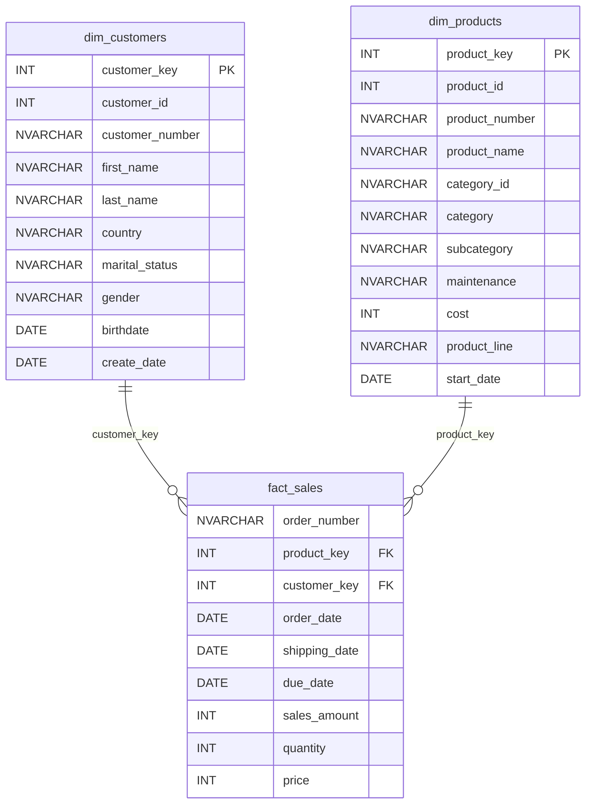

# 📊 SQL Exploratory Data Analysis & Business Intelligence Portfolio

A comprehensive, end-to-end SQL project demonstrating **Exploratory Data Analysis (EDA)**, **Advanced Analytical SQL**, and **Reporting View Creation** on a star-schema data warehouse. This repository walks through a structured approach to understanding business metrics, customer behavior, and product performance using SQL Server.

[](https://www.microsoft.com/sql-server)
[](https://learn.microsoft.com/en-us/sql/t-sql/)
[](LICENSE)

---

## 🏗️ Project Overview

This project utilizes a **Gold-layer star schema** consisting of two dimension tables and one fact table, representing a clean analytical database. The goal is to progress from initial schema exploration to complex business reporting views ready for BI tools (like Power BI or Tableau).

### 📐 Database Star Schema



---

## 📂 Repository Structure

```
sql-exploratory-data-analysis/
│
├── datasets/                          # Source CSV files
│   ├── dim_customers.csv              # Customer dimension (18K+ rows)
│   ├── dim_products.csv               # Product dimension (295 rows)
│   └── fact_sales.csv                 # Sales transactions (60K+ rows)
│
├── scripts/                           # SQL scripts (run in order)
│   ├── 00_init_database.sql           # Database setup and bulk data loading
│   ├── 01_database_exploration.sql    # Schema discovery and metadata exploration
│   ├── 02_dimensions_exploration.sql  # Unique values and categories discovery
│   ├── 03_date_range_exploration.sql  # Age range and date boundaries analysis
│   ├── 04_measures_exploration.sql    # Core sales counts, sums, and averages
│   ├── 05_magnitude_analysis.sql      # Sales aggregations grouped by categories
│   ├── 06_ranking_analysis.sql        # Top/Bottom performers and product ranking
│   ├── 07_change_over_time_analysis.sql # Time-series analysis and monthly trend analysis
│   ├── 08_cumulative_analysis.sql      # Monthly running totals and moving averages
│   ├── 09_performance_analysis.sql     # Year-over-Year (YoY) product sales growth analysis
│   ├── 10_data_segmentation.sql        # Spending behavior and product cost tiers
│   ├── 11_part_to_whole_analysis.sql   # Sales percentage contribution by category
│   ├── 12_report_customers.sql         # Customer-level reporting view (recency, AOV, spend)
│   └── 13_report_products.sql          # Product-level reporting view (AOR, monthly revenue)
│
├── docs/                              # Project documentation
│   └── eda_notebook.md                # Analysis notes and SQL techniques guide
│
├── .gitignore
├── LICENSE
└── README.md
```

---

## 🚀 Getting Started

### Prerequisites
- **SQL Server** (2019 or later recommended)
- **SQL Server Management Studio (SSMS)** or Azure Data Studio

### Setup Instructions
1. **Clone the Repository**
   ```bash
   git clone https://github.com/<your-username>/sql-exploratory-data-analysis.git
   ```

2. **Configure CSV File Paths**
   Open `scripts/00_init_database.sql` and update the `BULK INSERT` paths to target your local folder. For example, find lines 101, 113, and 125, and replace:
   ```sql
   FROM 'C:\sql\sql-exploratory-data-analysis\datasets\dim_customers.csv'
   ```
   with your actual local path:
   ```sql
   FROM 'C:\Users\YourName\Desktop\sql-exploratory-data-analysis\datasets\dim_customers.csv'
   ```

3. **Execute SQL Scripts**
   Run the scripts sequentially (from `00` to `13`) in SSMS to construct the database, explore data, perform calculations, and create the reporting views.

---

## 📋 Comprehensive SQL Walkthrough

The scripts walk through a professional data analytics workflow, divided into four clear developmental phases:

| Phase | Script # | Script Name | Core SQL Concepts Covered | Purpose / Learning Outcome |
|:---|:---:|:---|:---|:---|
| **Phase 1: Setup** | 00 | `00_init_database.sql` | `CREATE DATABASE`, `BULK INSERT`, `TRUNCATE` | Create database schemas, tables, load CSVs, and verify count sanity. |
| | 01 | `01_database_exploration.sql` | `INFORMATION_SCHEMA.COLUMNS`, metadata | Explore database design, table names, and column data types. |
| **Phase 2: EDA** | 02 | `02_dimensions_exploration.sql` | `DISTINCT`, `ORDER BY` | Find unique categories, countries, and genders to check data quality. |
| | 03 | `03_date_range_exploration.sql` | `MIN()`, `MAX()`, `DATEDIFF()` | Understand time boundaries of the data and age spans of customer base. |
| | 04 | `04_measures_exploration.sql` | `SUM()`, `AVG()`, `COUNT()`, `UNION ALL` | Compute baseline sums, orders, average product prices, and customers. |
| | 05 | `05_magnitude_analysis.sql` | `GROUP BY`, `JOIN` | Discover sales magnitudes by location, category, and demographics. |
| | 06 | `06_ranking_analysis.sql` | `ROW_NUMBER()`, `RANK()`, `DENSE_RANK()` | Rank top 5 products, top 10 customers, and identify lowest sales. |
| **Phase 3: Analytics** | 07 | `07_change_over_time_analysis.sql` | `YEAR()`, `MONTH()`, `DATETRUNC()`, `FORMAT()`| Track monthly revenue trends, growth rates, and seasonality. |
| | 08 | `08_cumulative_analysis.sql` | Window `SUM() OVER()`, `AVG() OVER()` | Calculate running sales totals and moving average prices over time. |
| | 09 | `09_performance_analysis.sql` | `LAG()`, `AVG() OVER (PARTITION BY ...)` | Perform Year-over-Year (YoY) sales change analysis per product. |
| | 10 | `10_data_segmentation.sql` | CTEs, `CASE` statement segmentation | Classify customers (VIP, Regular, New) and product price ranges. |
| | 11 | `11_part_to_whole_analysis.sql` | Grand-total `SUM() OVER()` calculations | Calculate the percentage sales contribution of categories to the total. |
| **Phase 4: Reports** | 12 | `12_report_customers.sql` | `CREATE VIEW`, CTES, Cohort Calculations | Compile customer metrics (recency, lifespan, spend, AOV) into views. |
| | 13 | `13_report_products.sql` | `CREATE VIEW`, `NULLIF()`, segments | Compile product metrics (AOR, monthly revenue, segmentations) into views. |

---

## 🔑 Key Business Questions Answered

- 📈 **Baseline Metrics**: What is the overall revenue, items sold, and average price? (Script `04`)
- 🌍 **Demographics**: How are customers distributed geographically, and who generates the most sales? (Script `05`)
- 🏆 **Performers**: Which top 5 products bring in the highest revenue, and who are our top 10 customers? (Script `06`)
- 📅 **Time Series**: Are sales seasonal? How does month-over-month sales performance fluctuate? (Script `07`)
- 🏃 **Running Totals**: What is the cumulative sales growth trajectory over time? (Script `08`)
- 📊 **Year-over-Year**: Which products grew in sales this year compared to last year? (Script `09`)
- 👥 **Segmentation**: How many customers fall into our VIP tier versus Regular and New tiers? (Script `10`)
- 🍕 **Contribution**: What percentage of total revenue does the "Bikes" category account for? (Script `11`)
- 💼 **Reporting Layer**: How can we query pre-calculated metrics (like Average Order Value, Customer Lifespan, and Recency) from a single reporting view? (Scripts `12` & `13`)

---

## 🛡️ License

This project is licensed under the [MIT License](LICENSE). Feel free to use, modify, and share it.

---

## About Me

Hello, I'm **Salah Gueroui**, passionate about **Data Analytics, Business Intelligence, Data Engineering, and Artificial Intelligence**. I enjoy building data-driven solutions using **SQL, Python, Power BI, and modern database technologies**, turning raw data into meaningful insights and business value.
